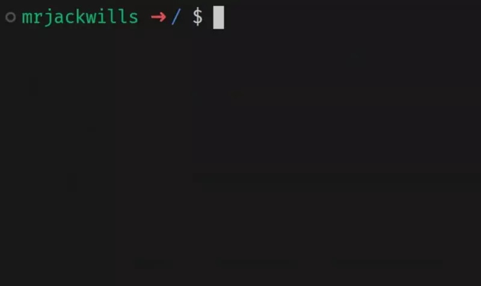

<p align="center">
	
	<h1 align="center">havn</h1>
	<div align="center">A fast configurable port scanner with reasonable defaults</div>
</p>

<p align="center">
	<a href="https://raw.githubusercontent.com/mrjackwills/havn/main/.github/screen.webp" target='_blank' rel='noopener noreferrer'>
		
	</a>
</p>

## Description
`havn` - `ˈheɪvən` || `"HAY" + "vuhn"` - is a lightweight self-contained port scanning application written in <a href='https://www.rust-lang.org/' target='_blank' rel='noopener noreferrer'>Rust</a>,
using asynchronous <a href='https://github.com/tokio-rs/tokio' target='_blank' rel='noopener noreferrer'>Tokio</a> multithreading to deliver fast and reliable results.
With sensible defaults and configurable options, users are able customise the scanning process according to their needs.
It is designed and built to be compatible with multiple platforms, including Docker, and has a binary size of less than 1mb.


## Download & install

### Cargo
Published on <a href='https://www.crates.io/crates/havn' target='_blank' rel='noopener noreferrer'>crates.io</a>, so if you have cargo installed, simply run

```shell
cargo install havn
```

### Docker

Published on <a href='https://hub.docker.com/r/mrjackwills/havn' target='_blank' rel='noopener noreferrer'>Docker Hub</a> and <a href='https://ghcr.io/mrjackwills/havn' target='_blank' rel='noopener noreferrer'>ghcr.io</a>,
with images built for `linux/amd64`, `linux/arm64`, and `linux/arm/v6`

**via Docker Hub**
```shell
docker run --rm -it mrjackwills/havn:latest #[options]
```

**via ghcr.io**

```shell
docker run --rm -it ghcr.io/mrjackwills/havn:latest #[options]
```

❗Caution: To scan the Docker host itself, you must grant access by including the option:

```shell
--network=host
```

### Pre-Built
See the <a href="https://github.com/mrjackwills/havn/releases/latest" target='_blank' rel='noopener noreferrer'>pre-built binaries</a>

or, download & install (x86_64 one liner)

```shell
wget https://www.github.com/mrjackwills/havn/releases/latest/download/havn_linux_x86_64.tar.gz &&
tar xzvf havn_linux_x86_64.tar.gz havn &&
install -Dm 755 havn -t "${HOME}/.local/bin" &&
rm havn_linux_x86_64.tar.gz havn
```

or, for automatic platform selection, download, and installation (to `$HOME/.local/bin`)

*One should always verify <a href='https://raw.githubusercontent.com/mrjackwills/havn/main/install.sh' target='_blank' rel='noopener noreferrer'>script content</a> before running in a shell*

```shell
curl https://raw.githubusercontent.com/mrjackwills/havn/main/install.sh | bash
```
## Run

```shell
havn #[options]
```
Available command line arguments
| argument|result|
|--|--|
| ```[string]```			| The address or IP to scan. [default: `127.0.0.1`] |
|```-a```					| Scan every port, from `1` to `65535`, conflicts with `-p` |
|```-c [number]```			| How many concurrent request should be made. [default: `1000`] |
|```-m```					| Monochrome mode - won't colourize the output [default: `false`] |
|```-p [number / string]```	| Inclusive port range to scan, accepts either a range: `-300`, `101-200`, or a single port `80`, conflicts with `-a` [default: `-1000`] |
|```-r [number]```			| Retry attempts per port. [default: `1`] |
|```-t [number]```			| Timeout for each request in milliseconds. [default: `2000`] |
|```-6```					| Scan the IPv6 address instead of IPv4, [default: `false`] |

### Examples

```shell
# Scan github.com using the default settings
havn github.com

# Scan default address [127.0.0.1], all ports [1-65535],
# 2048 concurrent requests, 500ms timeout, 0 retries, IPv4
havn -a -c 2048 -t 500 -r 0

# Scan www.google.com, ports 10-600,
# 500 concurrent requests, 3000ms timeout, default retries [1], IPv4
havn www.google.com -p 10-600 -c 500 -t 3000 

# Scan www.digitalocean.com, ports 1-100
# default concurrent requests[1000], 1000ms timeout, and use IPv6 address
havn www.digitalocean.com -p -100 -t 1000 -6

# Scan www.bbc.com, port 443 only
# default concurrent requests[1000], default timeout[2000ms], 6 retries, IPv4
havn www.bbc.com -p 443 -r 6
```

### Todo

- [ ] Scan UDP ports, currently only TCP
- [ ] allow multiple addresses/IPs to be scanned
- [ ] monitor response times to automatically modify request settings
- [ ] configurable option to disable second-pass scan
- [ ] debug option to display more verbose output
- [ ] improve windows performance
- [ ] publish to npm


## Tests

A number of tests will open port 80, this may cause issues if the port is already open on your system

```shell
cargo test -- --test-threads=1
```

## Build step

### x86_64

```shell
cargo build --release
```

### Cross platform
### Using Docker
requires <a href='https://www.docker.com/' target='_blank' rel='noopener noreferrer'>Docker</a> & <a href='https://github.com/cross-rs/cross' target='_blank' rel='noopener noreferrer'>cross-rs</a>


#### 64bit arm (pi 4, pi zero w 2)

```shell
cross build --target aarch64-unknown-linux-musleabihf --release
```

#### 32bit pi (pi zero w)

```shell
cross build --target arm-unknown-linux-musleabihf --release
```

#### Windows x86_64

```shell
cross build --target x86_64-pc-windows-gnu --release
```

### Without Docker
#### 64bit arm (pi 4, pi zero w 2)
edit `~/.cargo/config`
```
[target.aarch64-unknown-linux-musl]
linker = "rust-lld"
```

```shell
rustup target add aarch64-unknown-linux-musl
cargo build --target aarch64-unknown-linux-musl --release
```
#### 32bit pi (pi zero w)

edit `~/.cargo/config`
```
[target.arm-unknown-linux-musleabihf]
linker = "arm-linux-gnueabihf-ld"
```

```shell
sudo apt update && sudo apt install gcc-arm-linux-gnueabihf -y
rustup target add arm-unknown-linux-musleabihf
cargo build --target arm-unknown-linux-musleabihf --release
```

#### Windows (build on linux)

edit `~/.cargo/config`
```
[target.x86_64-pc-windows-gnu]
linker = "x86_64-w64-mingw32-gcc"
ar = "x86_64-w64-mingw32-gcc-ar"
```

```shell
sudo apt update && sudo apt install mingw-w64
rustup target add x86_64-pc-windows-gnu
cargo build --target x86_64-pc-windows-gnu --release
```

**Untested on other platforms**